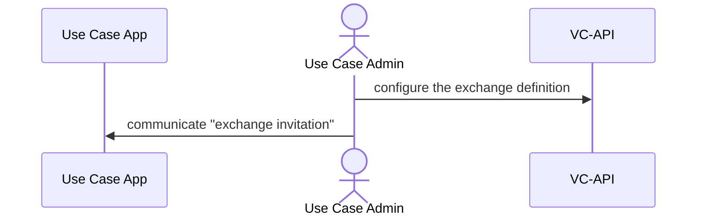
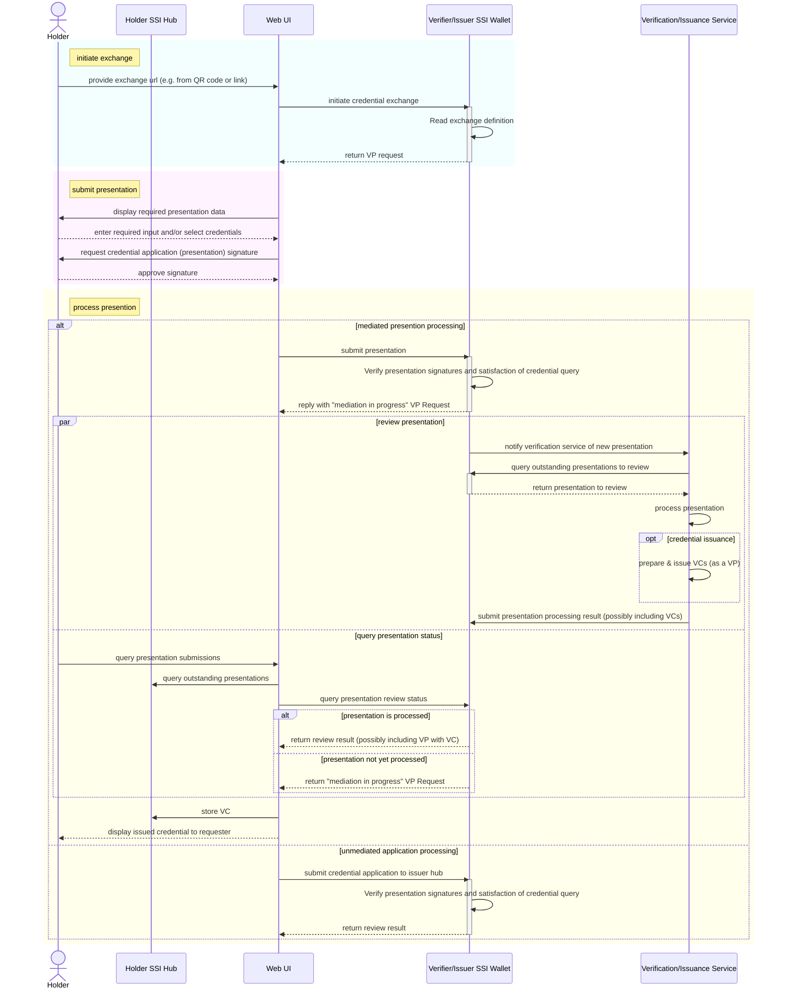

<p align="center">
  <a href="https://www.energyweb.org" target="blank"></a>
  <a href="https://www.eliagroup.com/" target="blank"></a>
</p>


# EWF and Elia Group Self-Sovereign-Identity (SSI) Wallet Apps

[](https://github.com/energywebfoundation/ssi/actions/workflows/main.yml)

## Introduction
This repository provides *sample* Self-Sovereign-Identity (SSI) wallet applications and libraries to enable these apps.
These are currently provided for demonstration purposes.
Currently, only a NestJs wallet is provided but more may be added in the future.
The functionality is mostly generic functionality based on cryptography and SSI standards,
however the intention is that it can be used to enable more specific energy industry use cases.

These SSI wallet apps are a component of the [Energy Web Decentralized Operating System](#ew-dos).
For more information about SSI at EWF, see the [EWF Gitbook page on SSI](https://energy-web-foundation.gitbook.io/energy-web/foundational-concepts/self-sovereign-identity).

## Technology Decisions
### Rationale for Spruce DIDKit
Spruce's DIDKit is used for DID generation and credential issuance+verification.
The rational for Spruce's use is that it:
- Is written in Rust and so suitable for use in any mobile app development framework
- Supports JSON-LD and JWT credential issuance and verification
- Supports did:key, did:ethr, did:web
- DIDKit (and its libraries) are open-source

### Rationale for NestJS
- Main JS server framework used at EWF

## Architecture


## NestJS Wallet 

The NestJS Wallet can be considered a [Cloud Wallet](https://w3c-ccg.github.io/universal-wallet-interop-spec/#cloud-wallets).

### VC-API Module
(Partial) implementation of the [W3C Credentials Community Group](https://w3c-ccg.github.io/) [VC API Specification](https://w3c-ccg.github.io/universal-wallet-interop-spec/).
This spec provides a data model and HTTP protocols to issue, verify, present, and exchange verifiable credentials on the Web.
The [W3C Credentials Community Group](https://w3c-ccg.github.io/) also publishes [use cases for VC API](https://w3c-ccg.github.io/vc-api-use-cases/index.html).

#### Standard vs Custom Endpoints

Not all of the endpoints available from the VC-API module are standard.

| Purpose | Standard | Spec Link
| --- | --- | --- |
| Issue Credential | Yes | https://w3c-ccg.github.io/vc-api/#issue-credential
| Prove Presentation | Yes | https://w3c-ccg.github.io/vc-api/#prove-presentation
| Initiate Exchange | Yes | https://w3c-ccg.github.io/vc-api/#initiate-exchange
| Continue Exchange | Yes | https://w3c-ccg.github.io/vc-api/#continue-exchange
| Configure Exchange | No | 
| Query Submissions | No |  
| Submit Processing Result | No |

### DID Module

The DID Module in the [nestjs-wallet](./apps/nestjs-wallet) offers the generation of DIDs and tracking the data resolvable in their DID documents.

#### DID Generation
The DID generation logic is encapsulated in a [did](./libraries/did) library.
This potentially allows the logic to be shared between wallets of various form-factors (e.g. nodejs wallet, a web wallet, another nodejs framework, etc in the future).

Often DID generation requires the generation of a new public-private keypair.
In order to rename agnostic to the key-generation and storage preferences of a particular wallet implementation, the [did](./libraries/did) DID factories accept public keys in the standard format of JWK.

An abstracted process of creating a DID controlled by a asymmetric key-pair is therefore:
```javascript
const key = generateKey(); // Generate a key pair and return the public key necessary to create the DID
const did = generateDID(key); // Code from ssi-did lib. Returns initial DID Document of DID, including Verification Methods
```

### Key Module
The key module is kept separate from the DID module because it's plausible that key module will be provided by a different service (i.e. a dedicated KMS) at some point.

## NestJS Wallet Implementation Notes
- Uses **in-memory DB** for now for app execution and tests.
The rationale for this for executions that, as the app is only being used in a demo context, it is not necessary to persist data between executions.
The rationale for this for tests (rather than mocking the db) is that it speeds test writing time, elimates mocking boilerplate and possibly buggy DB mocks.

## Credential Exchange Flow

This flow is based of [VC-API Exchanges](https://w3c-ccg.github.io/vc-api/#initiate-exchange).

### Initial Exchange Configuration


### Credential Presentation/Issuance

The following is a sequence diagram of an credential exchange flow.
This flow can be either a credential verification exchange (an exchange between a holder and a verifier) or a credential issuance exchange (an exchange between an issuer and a verifier).



## Installation
This repository is a monorepo that uses [Rush](https://rushjs.io/) with the PNPM package manager.

PNPM is used for its speed and solution to NPM doppelgangers (as well as being the default option for rush).
See comparison of [NPM vs PNPM vs Yarn for Rush](https://rushjs.io/pages/maintainer/package_managers/).

### Requirements

PNPM is required. See installation instructions here: https://pnpm.js.org/installation/

Rush is required. See installation instructions here: https://rushjs.io/pages/intro/get_started/

Use rush to install dependencies (not the package manager directly).
In other words, do not run `npm install` or `pnpm install`.
This is because [Rush optimizes](https://rushjs.io/pages/developer/new_developer/) by installing all of the dependency packages in a central folder, and then uses symlinks to create the “node_modules” folder for each of the projects.

```sh
$ rush install
```

### Compile & Build
Use rush to build.

```sh
$ rush build
```

## Run
To run the `nestjs-wallet` app
``` sh
$ cd apps/nestjs-wallet
$ pnpm run start
```

After starting the `nestjs-wallet` app, 
the Swagger/OpenAPI test page can be see at `{appURL}/api` (`http://localhost:3000/api` if running locally)

## Testing
To run all tests in one command, a rush script has been added to `./common/config/rush/command-line.json` 
``` sh
$ rush test
```

### NestJS Wallet Tests
The NestJS wallet app has separate unit and e2e tests.
See NestJS [testing documentation](https://docs.nestjs.com/fundamentals/testing#testing) for more information.
These can be run with separate commands if desired.

First navigate to the app
``` sh
$ cd apps/nestjs-wallet
```

Then, to run **unit** tests
``` sh
$ pnpm test:unit
```

Or, to run **e2e** tests
``` sh
$ pnpm test:e2e
```

## Documentation

## Who is Using This Repo?

## Contributing Guidelines 
See [contributing.md](./contributing.md)


## Questions and Support
For questions and support please use Energy Web's [Discord channel](https://discord.com/channels/706103009205288990/843970822254362664) 

Or reach out to our contributing team members

- TeamMember: email address@energyweb.org


# EW-DOS
The Energy Web Decentralized Operating System is a blockchain-based, multi-layer digital infrastructure. 

The purpose of EW-DOS is to develop and deploy an open and decentralized digital operating system for the energy sector in support of a low-carbon, customer-centric energy future. 

We develop blockchain technology, full-stack applications and middleware packages that facilitate participation of Distributed Energy Resources on the grid and create open market places for transparent and efficient renewable energy trading.

- To learn about more about the EW-DOS tech stack, see our [documentation](https://app.gitbook.com/@energy-web-foundation/s/energy-web/).  

- For an overview of the energy-sector challenges our use cases address, go [here](https://app.gitbook.com/@energy-web-foundation/s/energy-web/our-mission). 

For a deep-dive into the motivation and methodology behind our technical solutions, we encourage you to read our White Papers:

- [Energy Web White Paper on Vision and Purpose](https://www.energyweb.org/reports/EWDOS-Vision-Purpose/)
- [Energy Web  White Paper on Technology Detail](https://www.energyweb.org/wp-content/uploads/2020/06/EnergyWeb-EWDOS-PART2-TechnologyDetail-202006-vFinal.pdf)

## Relationship to other EWF components

### iam-client-lib
[iam-client-lib](https://github.com/energywebfoundation/iam-client-lib/) provides SSI related functions such as interaction with EWF's Switchboard role credential definitions, credential request and issuance and connection to the ssi-hub.
It could be used as a client library to this wallet.

### ssi-hub
[ssi-hub](https://github.com/energywebfoundation/ssi-hub)'s persistence of issued credentials, requested credentials and DID relationships could be integrated with the code in this repository.

### ew-did-registry
[ew-did-registry](https://github.com/energywebfoundation/ew-did-registry) Though some code should be integrated between ew-did-registry and this repository,
it is currently useful to have the sample wallets in a separate application to avoid a circular dependency where `iam-client-lib` depends on `ssi/ew-did-registry` which depends on `iam-client-lib`.

## Relevant SSI Ecosystem Entities
### W3C Credentials Community Group
The [W3C Credentials Community Group](https://w3c-ccg.github.io/) provides drafting and incubating Internet specifications for further standardization and prototyping and testing reference implementations.
Several of these specifications are used to guide the development of the wallets in this repository.
Though these specifications are not on the W3C standards track, adherance to them is valuable because:
- It leverages the design and experience of a collaboration of experts in the SSI credentials ecosystem
- It increases interoperability and the likelihood that apps/components could be swapped for other implementations

#### Universal Wallet Interop Spec
The [W3C Credentials Community Group](https://w3c-ccg.github.io/) [Universal Wallet Interop Specification](https://w3c-ccg.github.io/universal-wallet-interop-spec/) provides a model for how wallet data could be made interoperable between other wallet implementations.

### DIF Wallet Security Group
The [DIF Wallet Secruity Group](https://identity.foundation/working-groups/wallet-security.html) is helping defined SSI wallet best practices.

## Connect with Energy Web
- [Twitter](https://twitter.com/energywebx)
- [Discord](https://discord.com/channels/706103009205288990/843970822254362664)
- [Telegram](https://t.me/energyweb)

## License

This project is licensed under the GNU General Public License v3.0 or later - see the [LICENSE](LICENSE) file for details

