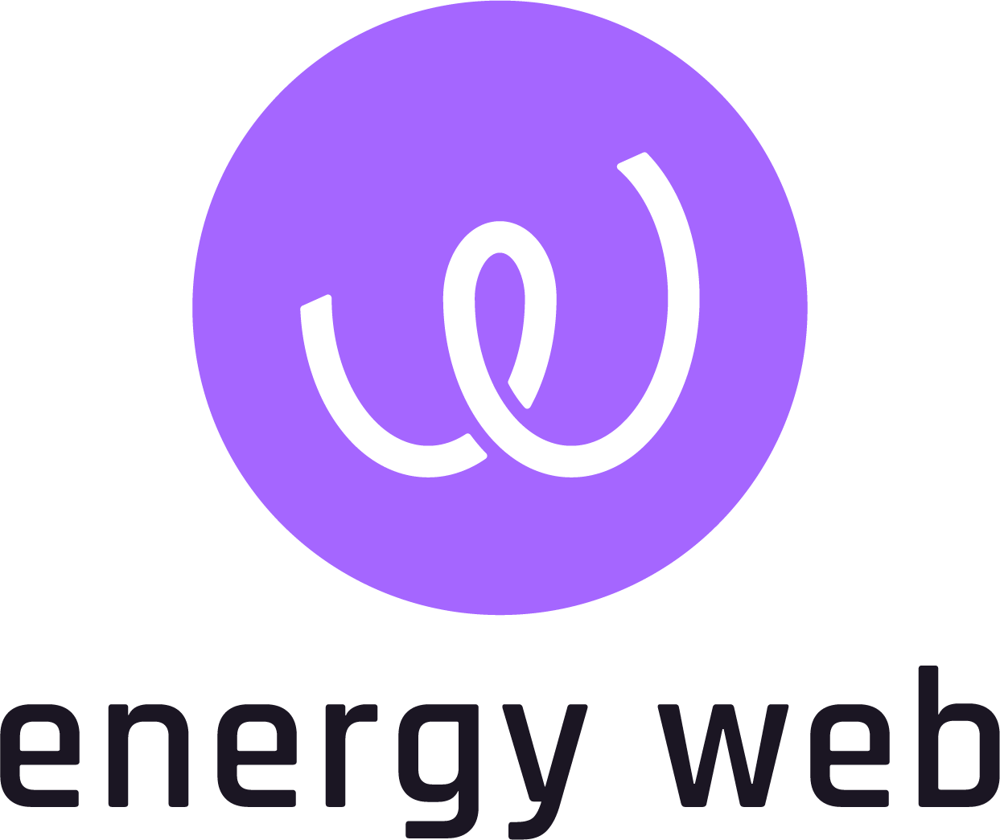

# OWF VC API Implementation

[](https://github.com/energywebfoundation/ssi/actions/workflows/main.yml)

## Introduction
This repository provides a NestJs  [VC API implementation](./apps/vc-api/) of the [W3C Credentials Community Group](https://w3c-ccg.github.io/) [VC API Specification](https://w3c-ccg.github.io/vc-api).

This is project is a Labs project under the [Open Wallet Foundation](https://openwallet.foundation/).

## Overview Documentation

For background on the VC API and how to use this project in your architecture, see the [overview documentation site](https://openwallet-foundation-labs.github.io/vc-api).

## Supporting Organizations
In addition to being supported by the Open Wallet Foundation, this project is supported by the Elia Group, the Energy Web Foundation and Impactility.

<p align="center">
  <a href="https://www.energyweb.org" target="blank"></a>
  <a href="https://www.eliagroup.com/" target="blank"></a>
  <a href="https://impactility.com/" target="blank"></a>
</p>

## Technology Decisions

Architecture Decision Records are used to track technology and architecture decsions
(see [ADR 01](./apps/vc-api/docs/architecture/decisions/0001-record-architecture-decisions.md)).

The Architecture Decisions Records can be found [here](apps/vc-api/docs/architecture/decisions).

The [ADR Tools command line tool](https://github.com/npryce/adr-tools) can be used to add new ADRs.

## App Development
This repository is a monorepo that uses [pnpm workspaces](https://pnpm.io/workspaces).

PNPM is used for its speed and solution to NPM doppelgangers.

### Requirements

Node.js >= 24.9 is required (see `.nvmrc`).

pnpm is required. With Node.js installed, the easiest way to get it is `corepack enable`
(the version is pinned by the `packageManager` field in `package.json`).
See other installation options here: https://pnpm.io/installation

### Install

```sh
$ pnpm install
```

### Build

```sh
$ pnpm run build
```

## Testing
To run tests across all apps and libraries in one command:
``` sh
$ pnpm run test
```

## Release Process

Releases are done by manually creating a new release in GitHub.
Tooling like `release-please` or `release-it` could be used in the future to automate this process.

The release will trigger [a GitHub Action](/.github/workflows/container-image-publish.yml) to publish the new version to the GitHub Container Registry.

## Docs Editing

To edit the documentation, you can run the following command to start the docs server:

```sh
docker run --rm -it -p 8000:8000 -v ${PWD}:/docs squidfunk/mkdocs-material
```

If it's not working, the [mkdocs-material documentation](https://squidfunk.github.io/mkdocs-material/creating-your-site/#previewing-as-you-write) could be helpful for troubleshooting.

### Docs Publishing

The docs website is published by merging into the `develop` branch (see ./github/workflows/docs.yml).

## Contributing Guidelines 
See [contributing.md](./contributing.md)

## Questions and Support
For questions and support please use the Github issues.

## License

This project is licensed under the Apache 2.0 license - see the [LICENSE](LICENSE) file for details

