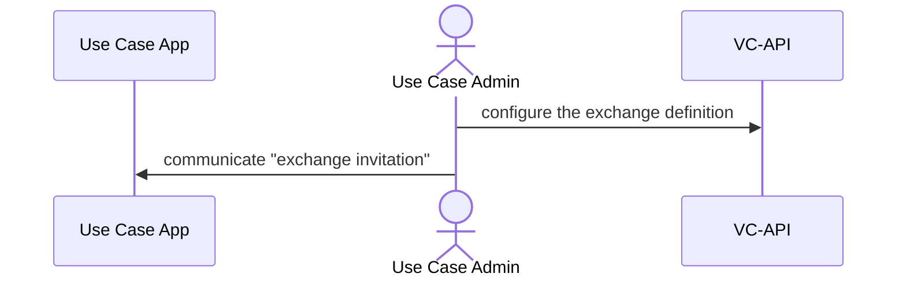
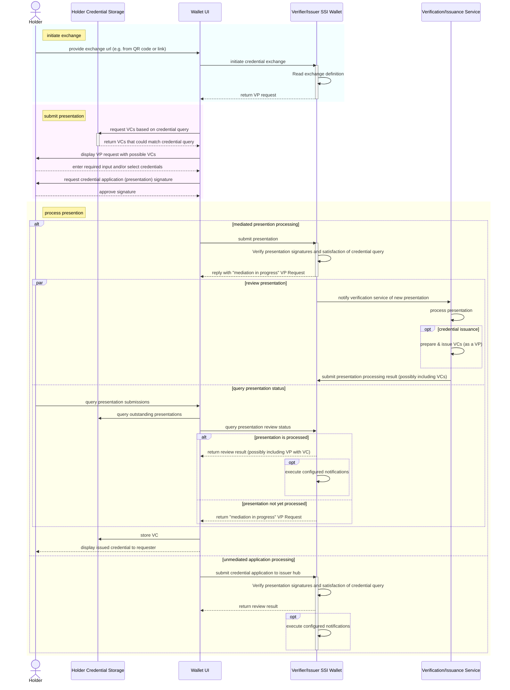

<!--
 Copyright 2021 - 2023 Energy Web Foundation
 
 This program is free software: you can redistribute it and/or modify
 it under the terms of the GNU General Public License as published by
 the Free Software Foundation, either version 3 of the License, or
 (at your option) any later version.
 
 This program is distributed in the hope that it will be useful,
 but WITHOUT ANY WARRANTY; without even the implied warranty of
 MERCHANTABILITY or FITNESS FOR A PARTICULAR PURPOSE.  See the
 GNU General Public License for more details.
 
 You should have received a copy of the GNU General Public License
 along with this program.  If not, see <http://www.gnu.org/licenses/>.
-->

# VC-API Exchanges

## Credential Exchange Flows

This flow is based of [VC-API Exchanges](https://w3c-ccg.github.io/vc-api/#initiate-exchange).

### Initial Exchange Configuration

### Credential Presentation/Issuance

The following is a sequence diagram of an credential exchange flow.
This flow can be either a credential verification exchange (an exchange between a holder and a verifier) or a credential issuance exchange (an exchange between an issuer and a verifier).

## Exchange Definitions

In order to keep the VC-API implementation generic (not specific to any use-cases), exchanges are configured rather than coded into the application.

This configuration is done at runtime via the use of Exchange Definitions.

For details on the structure and properties of an exchange definition, see the [Exchange Definition Data Transfer Object documentation](../src/vc-api/exchanges/dtos/exchange-definition.dto.ts).

Exhange Definitions are currently non-standard and custom to this VC-API implementation.

### Exchange Definition Structure and Properties

#### Exchange Queries

The `query` property of the Exchange Definition defines which data is to be requested by the exchange.

The types of queries supports are defined by [VpRequestQueryType](../src/vc-api/exchanges/types/vp-request-query-type.ts).

##### Presentation Definition Queries

A Presentation Definition is a [DIF specification](https://identity.foundation/presentation-exchange/#presentation-definition).
It is used to "articulate what proofs a Verifier requires".

Presentation Definitions must contain an `id` property and this property should be unique within the context that the definition will be used.
Currently, the Presentation Definition `id` is **not** used by the VC-API implementation.
For simplicity, it may be set to the same value as the [exchange id](../src/vc-api/exchanges/dtos/exchange-definition.dto.ts) or to an arbitrary UUID.

#### Exchange Callbacks

When defining an exchange, callbacks can be configured to allow parties to receive notice of a VP submitted in response to an exchange.
Notifications consist of POST requests to the configured URLs.
A callback is configured by adding an entry to the callback array in the [Exchange Definition](../src/vc-api/exchanges/dtos/exchange-definition.dto.ts).

For an example of the result of a callback notification, see the [Resident Card Tutorial](../docs/tutorials/resident-card-tutorial.md#17-authority-portal-check-for-notification-of-submitted-presentation).

#### Exchange Interact Services

The exchange interaction types used by this VC-API implementation are directly related to Verifiable Presentation Request [Interaction Types](https://w3c-ccg.github.io/vp-request-spec/#mediated-presentation).
The interaction types indicate to the receiver of the presentation request how they can expect to interact further with the issuer/verifier.

##### Mediated Exchange Interactions

Mediated exchange interactions signal to the receiver of the presentation request that the exchange is mediated by an additional component and may not be automatically processed.
Mediated exchanges therefore allow for a review of presention submission by a human or automated process as well as the issuance of credentials based on this review.

Due to the duration of the mediation process being unknown, the submitter of the verifiable presentation may have to query repeateadly in order to check if the result of the mediation is available.

##### Unmediated Exchange Interactions

Mediated exchange interactions signal to the receiver of the presentation request that the exchange is not mediated by an additional component and can be automatically processed.

### Exchange Definition Examples

#### Exchange Definition for Issuance

For issuance, a [Mediated Exchange](./exchanges.md#mediated-exchange-interactions) is required.
This is because the issued VC will often depend data supplied by the credential requester (the eventual "holder").
For example, the subject id of the credential may be a DID confirmed by a "DIDAuth" process
or the VC may contain a "trust level" attribute based on the data provided in a VP by the holder.

An example exchange definition for issuance can be seen in the [Resident Card tutorial](./tutorials/resident-card-tutorial.md#authority-portal-configure-the-credential-issuance-exchange).

#### Exchange Definition For Presentation

For credential presentations, either a [Mediated Exchange](./exchanges.md#mediated-exchange-interactions)
or an [Unmediated Exchange](./exchanges.md#unmediated-exchange-interactions) can be used.

An example exchange definition of an unmediated exchange for presentation can be seen in the [Resident Card tutorial](./tutorials/resident-card-tutorial.md#verifier-configure-credential-exchange).
