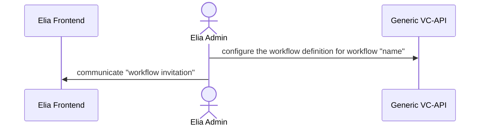
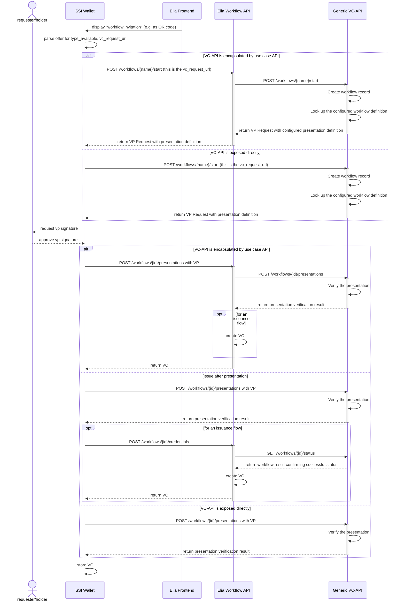

# Initial Workflow Configuration

```mermaid
sequenceDiagram
    participant E as Elia Frontend
    actor EA as Elia Admin
    participant VC as Generic VC-API
    
    EA->>VC: configure the workflow definition for workflow "name" 
    EA->>E: communicate "workflow invitation" 
```

# Credential Presentation/Issuance

The initial HTTP request for the VP Request could be made directly to the generic VC-API.

```mermaid
sequenceDiagram
    actor R as requester/holder
    participant H as SSI Wallet 
    participant E as Elia Frontend
    participant EWA as Elia Workflow API
    participant VC as Generic VC-API
    
    E->>H: display "workflow invitation" (e.g. as QR code)
    H->>H: parse offer for type_available, vc_request_url
    
    alt VC-API is encapsulated by use case API
      H->>EWA: POST /workflows/{name}/start (this is the vc_request_url)
      activate EWA
      EWA->>VC: POST /workflows/{name}/start
      activate VC
        VC->>VC: Create workflow record
        VC->>VC: Look up the configured workflow definition
        VC-->>EWA: return VP Request with configured presentation definition
      deactivate VC
      EWA-->>H: return VP Request with presentation definition 
      deactivate EWA
    else VC-API is exposed directly
      H->>VC: POST /workflows/{name}/start (this is the vc_request_url)
      activate VC
      VC->>VC: Create workflow record
      VC->>VC: Look up the configured workflow definition
      VC-->>H: return VP Request with presentation definition 
      deactivate VC
    end

    H->>R: request vp signature
    R-->>H: approve vp signature
    
    alt VC-API is encapsulated by use case API
      H->>EWA: POST /workflows/{id}/presentations with VP
      activate EWA
      EWA->>VC: POST /workflows/{id}/presentations 
      activate VC
        VC->>VC: Verify the presentation
        VC-->>EWA: return presentation verification result 
      deactivate VC
      opt for an issuance flow
      EWA->>EWA: create VC
      end
      EWA-->>H: return VC
      deactivate EWA
    else Issue after presentation
      H->>VC: POST /workflows/{id}/presentations with VP
      activate VC
        VC->>VC: Verify the presentation
        VC-->>H: return presentation verification result 
      deactivate VC
      opt for an issuance flow
        H->>EWA: POST /workflows/{id}/credentials
        activate EWA
        EWA->>VC: GET /workflows/{id}/status 
        VC-->>EWA: return workflow result confirming successful status
        EWA->>EWA: create VC
        EWA-->>H: return VC
      end
      deactivate EWA
    else VC-API is exposed directly
      H->>VC: POST /workflows/{id}/presentations with VP
      activate VC
        VC->>VC: Verify the presentation
        VC-->>H: return presentation verification result 
      deactivate VC
    end
    
    H->>H: store VC 
```
